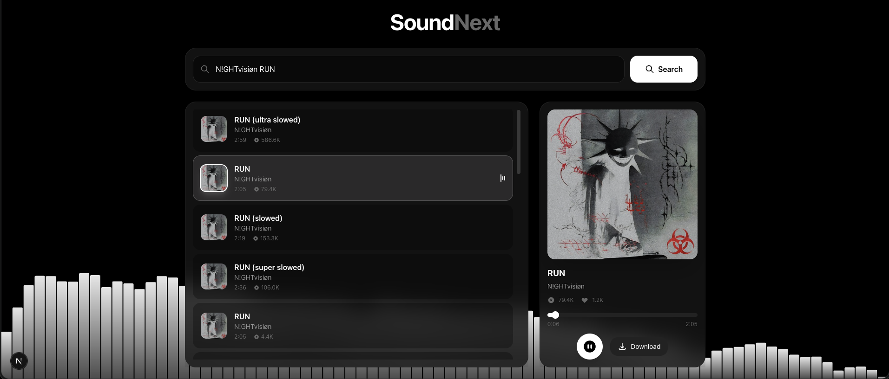

# SoundNext 🎵

<p align="center">
  
</p>

A modern web application for streaming and downloading music from SoundCloud, built with Next.js and FastAPI.




## Features ✨

### 🎵 Playback & Streaming
- **Search tracks** by name - no URL needed!
- **Stream music** directly in your browser
- **Auto-play next track** - continuous playback experience
- **Smart caching** - liked tracks load instantly without API calls
- **Seamless navigation** - music keeps playing when switching pages
- **Media Session API** integration - native OS media controls support

### ⌨️ Keyboard Controls
- `Space` - Play/Pause
- `F7` / `MediaTrackPrevious` - Previous track
- `F8` / `MediaPlayPause` - Play/Pause  
- `F9` / `MediaTrackNext` - Next track
- `Shift + ←` - Previous track
- `Shift + →` - Next track

### ❤️ Liked Tracks Management
- **Persistent storage** - likes saved to `~/.soundnext/liked_tracks.json`
- **Auto-caching** - liked tracks download automatically in background
- **Smart cache cleanup** - only non-liked tracks are removed on app close
- **Sync across sessions** - your likes survive app restarts

### 💾 Download & Metadata
- **Download tracks** with embedded metadata and artwork
- **High-quality artwork** - album art embedded in MP3 files
- **ID3 tags** - artist, title, duration automatically added

### 🎨 User Interface
- **Beautiful UI** with modern design and smooth animations
- **Like animations** - satisfying heart animations
- **Profile page** to view and manage your liked tracks
- **Track information** - play counts and likes from SoundCloud
- **Real-time progress** tracking with seekable timeline

## Quick Start 🚀

### Prerequisites
- Node.js 18+ and npm
- Python 3.9+
- FFmpeg (for audio processing)

### Installation

1. **Clone the repository**
```bash
git clone https://github.com/yourusername/soundnext.git
cd soundnext
```

2. **Install frontend dependencies**
```bash
npm install
```

3. **Install backend dependencies**
```bash
cd backend
pip install -r requirements.txt
```

4. **Install FFmpeg** (if not already installed)
```bash
# macOS
brew install ffmpeg

# Ubuntu/Debian
sudo apt install ffmpeg

# Windows (using Chocolatey)
choco install ffmpeg
```

### Running the Application

**Quick Start (both frontend and backend):**
```bash
npm run dev
```

Or separately:

1. **Start the backend server**
```bash
cd backend
source venv/bin/activate  # or on Windows: venv\Scripts\activate
python main.py
```
The API server will start at `https://localhost:8000` (HTTPS)

> ⚠️ **First time setup**: Open https://localhost:8000 in your browser and accept the self-signed certificate

2. **Start the frontend** (in a new terminal)
```bash
npm run frontend
```
The website will be available at `http://localhost:3000`

## API Endpoints 📡

| Endpoint | Method | Description |
|----------|--------|-------------|
| `/health` | GET | Health check |
| `/search?q=query` | GET | Search tracks |
| `/track-info?url=url` | GET | Get track info |
| `/stream?url=url` | GET | Stream audio |
| `/download?url=url` | GET | Download track |
| `/likes` | GET | Get all liked tracks |
| `/likes` | POST | Add a liked track |
| `/likes/{track_id}` | DELETE | Remove a liked track |
| `/likes` | PUT | Sync liked tracks |

## Tech Stack 🛠️

### Frontend
- **Next.js 15** - React framework
- **React 19** - UI library
- **Tailwind CSS 4** - Styling
- **TypeScript** - Type safety

### Backend
- **FastAPI** - Python web framework
- **SoundCloud API** - Music streaming
- **FFmpeg** - Audio processing
- **Mutagen** - ID3 tag handling

## Project Structure 📁

```
soundnext/
├── src/
│   ├── app/              # Next.js pages
│   ├── components/       # React components
│   ├── contexts/         # React contexts
│   ├── hooks/            # Custom hooks
│   └── types/            # TypeScript types
├── backend/
│   ├── main.py           # FastAPI server
│   └── requirements.txt  # Python dependencies
├── img/                  # Images and assets
└── package.json          # Node.js dependencies
```

## License 📄

This project is licensed under the MIT License - see the [LICENSE](LICENSE) file for details.

## Disclaimer ⚠️

This application is for educational purposes only. Please respect SoundCloud's terms of service and the rights of content creators. Only download tracks that you have permission to download.
